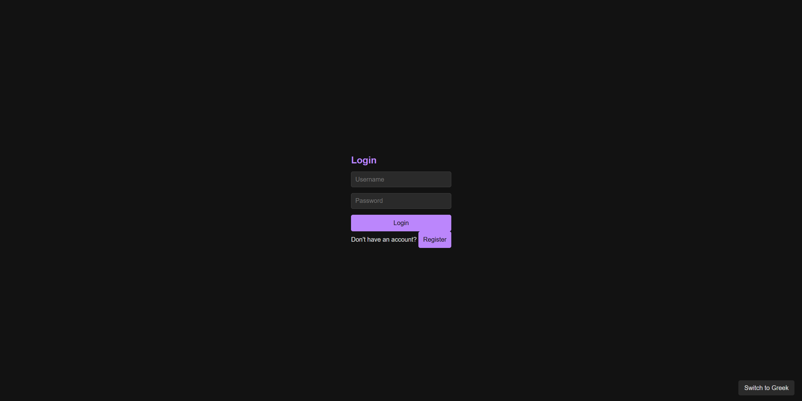
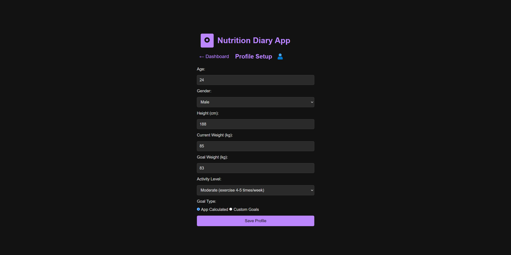
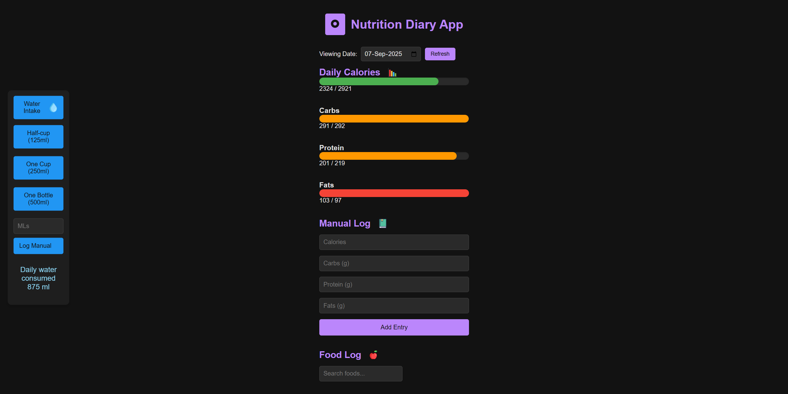
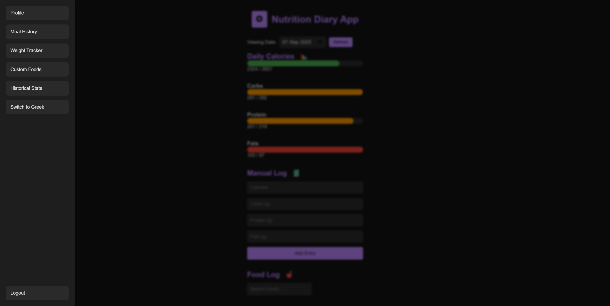
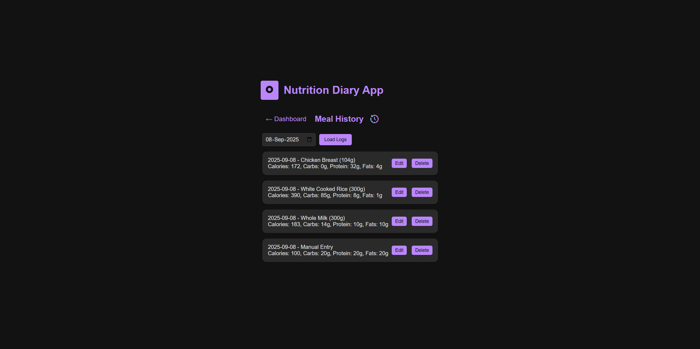
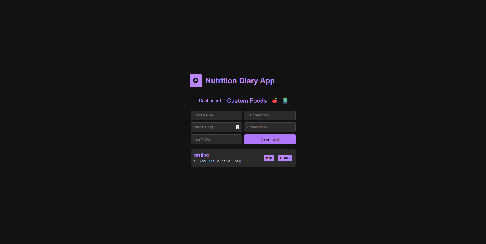
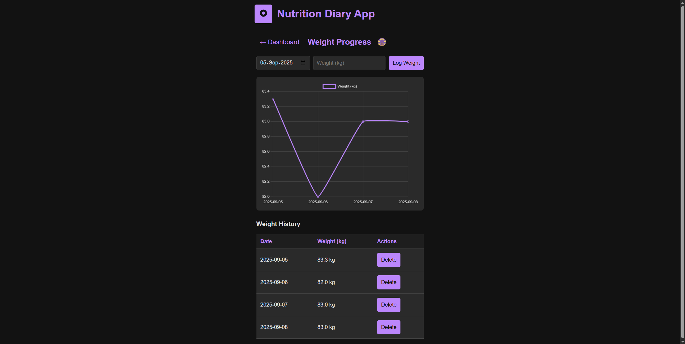
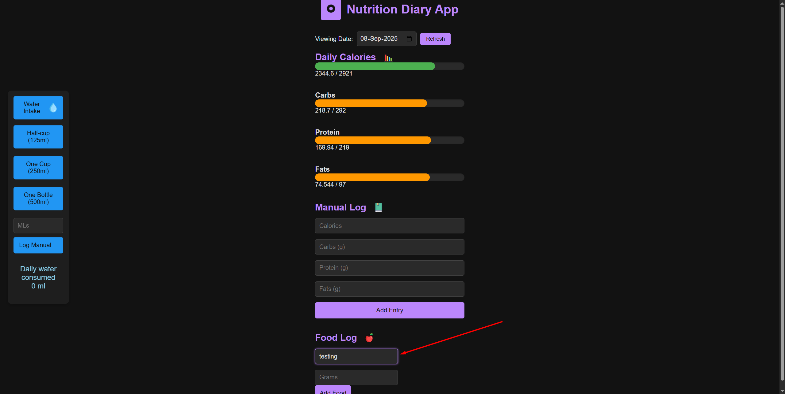
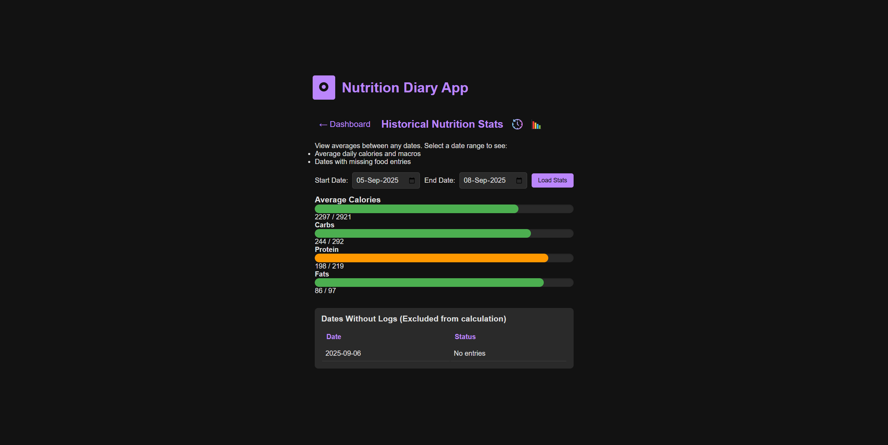
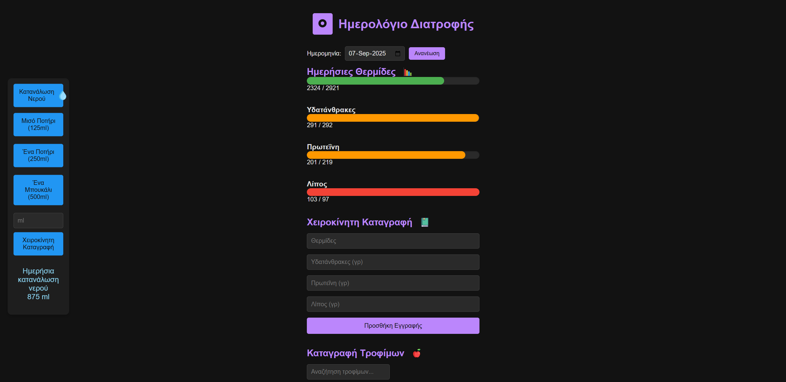

------------------------------------------------------------------

Nutrition Diary App:

Full-stack nutrition diary app 
Tracks food, calories/macros, weight progress , water intake and more. 
Includes a custom food database (user can add more foods)  , daily logs and weekly averages.
Multi-language support (English / Greek)
 
------------------------------------------------------------------

**** Quick demo / preview **** 

See screenshots in `/screenshots/` for a quick UI tour.

------------------------------------------------------------------

Technology Stack

Backend: Node.js with Express.js framework
Database: SQLite with custom database layer
Frontend: Vanilla JavaScript, HTML5, and CSS3
Authentication: bcrypt password hashing
Data Visualization: Chart.js for progress tracking
Development Tools:
  http-server for local development
  npm for package management

------------------------------------------------------------------

How to run locally 

Open two terminal windows and run the backend and frontend separately.

Terminal 1 — backend

"
cd nutrition-diary-app
cd backend
npm install   # first time only, installs dependencies
node server.js
"

Terminal 2 — frontend

"
cd nutrition-diary-app
cd frontend
npm install -g http-server   # first time only, installs http-server globally
http-server
"

Then open the app in your browser:
 http://127.0.0.1:8081/

Note: You need Node.js installed on your system to run this project.  
> If port 8081 is already in use, `http-server` will start on a different port (shown in the terminal).  
> In that case, just open the link it prints instead of `http://127.0.0.1:8081/`

------------------------------------------------------------------

Screenshots

Login/register Page with username checks and bcrypt-hashed passwords

Profile Setup page with input validation and checks.

Dashboard page with input validation and data checks. 

Side Drawer for easy navigation.  

Meal History page showing logged meals, with edit/delete functionality , which updates the dashboard.

Custom Foods page to add or delete user-defined foods from the database.  

Weight Progress page to add/delete weight logs and view progress graph.  

Custom Foods input example on Dashboard, supports adding grams and logging entries. Works like pre-existing foods.   

Historical Stats page calculates average daily calories, carbs, protein, and fats over a selected date range, highlights missing log days, and compares intake against goals with visual progress bars.

Greek Interface (example screen) — all pages and text are likewise fully translated.

------------------------------------------------------------------
