# Nutrition Diary App

Nutrition Diary is a full-stack nutrition tracking application that lets users log meals, track calories, macronutrients, weight progress, and water intake, maintain a custom food database, analyze nutrition trends over time, and receive AI-powered meal recommendations based on their goals and daily intake.


Built as a portfolio project. Originally my first full-stack application, it has since been revisited with a redesigned UI and an AI-powered nutrition assistant.


## Tech Stack

**Backend**
- Node.js with Express.js
- SQLite (custom database layer, no ORM)
- bcrypt password hashing

**Frontend**
- Vanilla JavaScript, HTML5, CSS3 (no framework, no build step)
- Chart.js for weight progress visualization
- marked.js + DOMPurify for rendering AI chat responses safely

**AI**
- Groq API (`openai/gpt-oss-120b`) for the in-app nutrition assistant

**Other**
- Multi-language support (English / Greek)
- npm for dependency management
- http-server for local frontend development

## Quick demo / preview

See screenshots in `/screenshots/` for a UI tour.

## Features

### Authentication & Profile
- Register/login with bcrypt-hashed passwords
- Profile setup with age, height, weight, activity level, and gender
- Goals calculated automatically (Mifflin-St Jeor based) or set manually as custom targets

### Dashboard & Food Logging
- Daily dashboard showing calories and macros against goals, with animated progress bars
- Manual nutrient entry, or searchable food logging from a built-in food database
- Custom foods — users can add their own foods with per-100g nutrition values

### AI Nutrition Assistant
- Floating chat assistant available throughout the app
- Understands the user's profile, daily targets, and everything logged so far today
- One-click "quick recommendation" for instant meal suggestions based on remaining calorie/macro budget
- Free-form chat for specific questions — e.g. "give me a high-protein dinner," "I only have chicken, eggs, and rice," "I have 600 calories left"
- Remaining-budget math is computed server-side (never left to the model), so recommendations are grounded in real numbers
- Responses rendered as formatted Markdown (bold, lists, headers) for readability

### History & Editing
- Meal history browsable by date, with edit/delete support
- Historical stats over any date range — average calories/macros, with dates missing logs automatically excluded

### Weight & Water Tracking
- Weight logging with a Chart.js progress graph and full history table
- Water intake tracker with quick-add buttons (125ml / 250ml / 500ml) and manual entry

### Design
- Dark theme with a green accent, custom background art on auth and app screens
- Bilingual UI (English/Greek), switchable at any time

## How to run locally

Open two terminal windows and run the backend and frontend separately.

**Terminal 1 — backend**
```
cd nutrition-diary-app
cd backend
npm install         # first time only, installs dependencies
node server.js
```

**Terminal 2 — frontend**
```
cd nutrition-diary-app
cd frontend
npm install -g http-server   # first time only, installs http-server globally
http-server
```

Then open the app in your browser: `http://127.0.0.1:8081/`

> If port 8081 is already in use, `http-server` will start on a different port (shown in the terminal) — open the link it prints instead.

### AI feature setup

The AI assistant requires a free Groq API key (no credit card required):

1. Sign up at [console.groq.com](https://console.groq.com)
2. Create an API key
3. In `backend/`, create a `.env` file:
   ```
   GROQ_API_KEY=your_key_here
   ```

The app runs normally without this — only the AI chat feature will be unavailable.

**Note:** You need Node.js installed on your system to run this project.

## Architecture notes

This project started as my first full-stack application, so the current codebase reflects that learning process. It uses a straightforward structure that keeps the app easy to run and understand, but future improvements would include refactoring larger files into more modular components and separating responsibilities further.

The backend handles authentication, database operations, nutrition logic, and AI integration. AI requests are processed server-side, keeping API keys secure and ensuring that prompts are built from trusted application data rather than directly from the client.

## Status

🚧 Active development — core tracking features complete; AI assistant and visual redesign recently added, further polish (retrieval-based food grounding, PDF-based health report analysis) under consideration.

## Screenshots

Login/register Page with username checks and bcrypt-hashed passwords

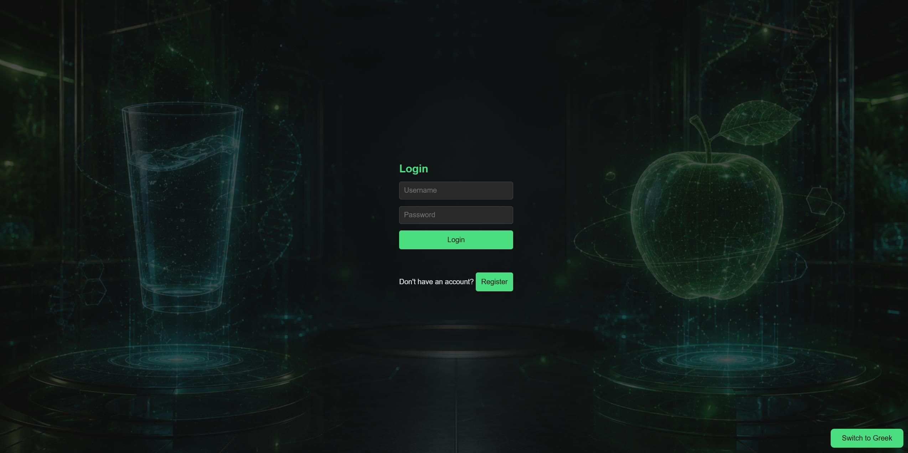

AI Nutrition Assistant open on the Dashboard — a floating glassmorphism chat panel (blur + transparency) that stays accessible from anywhere in the app once logged in, without disrupting the underlying page.

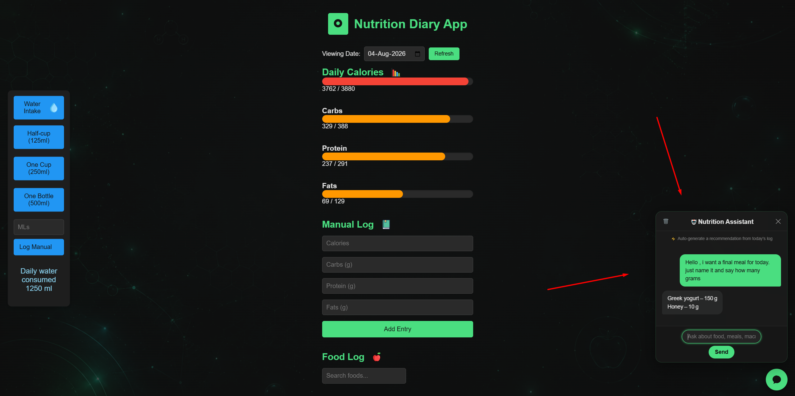

AI Assistant modal close-up, powered by Groq (openai/gpt-oss-120b). Pulls the user's live profile and today's logged totals server-side to compute an exact remaining calorie/macro budget, then generates grounded, context-aware suggestions — rendered as sanitized Markdown (marked.js + DOMPurify) with a typing indicator and quick-recommendation shortcut.

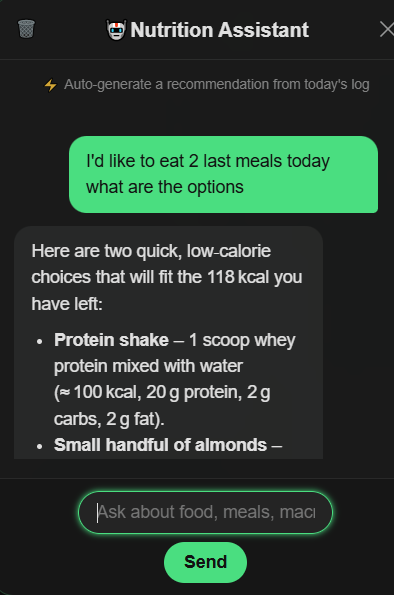

Profile Setup page with input validation; allows either automatic goal calculation (Mifflin-St Jeor) or custom calorie/macro targets.

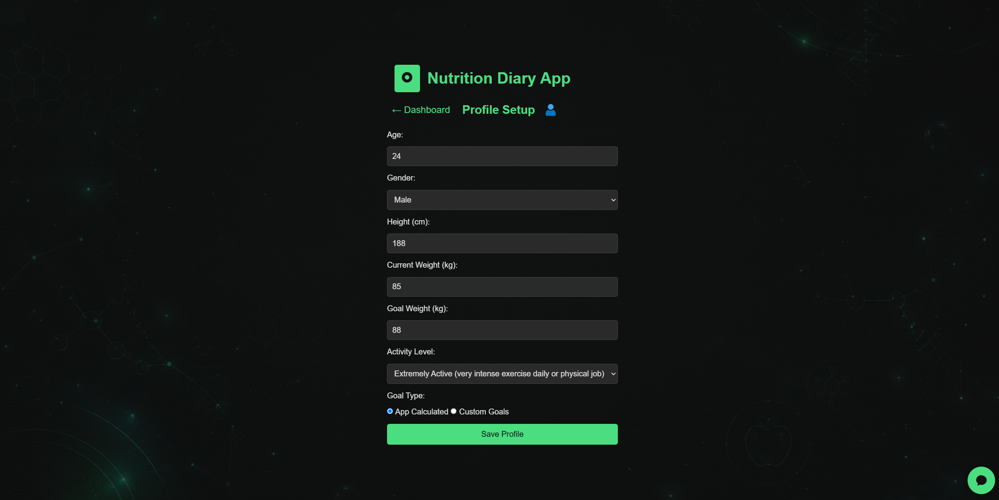

Dashboard page with input validation and data checks. 

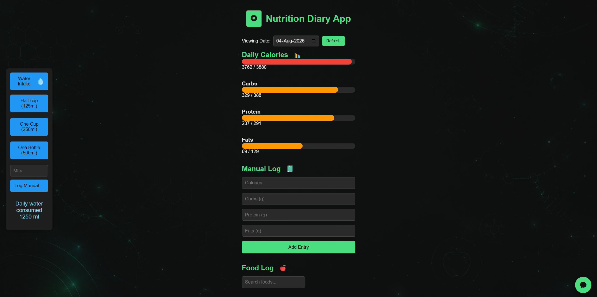

Side Drawer for easy navigation.  

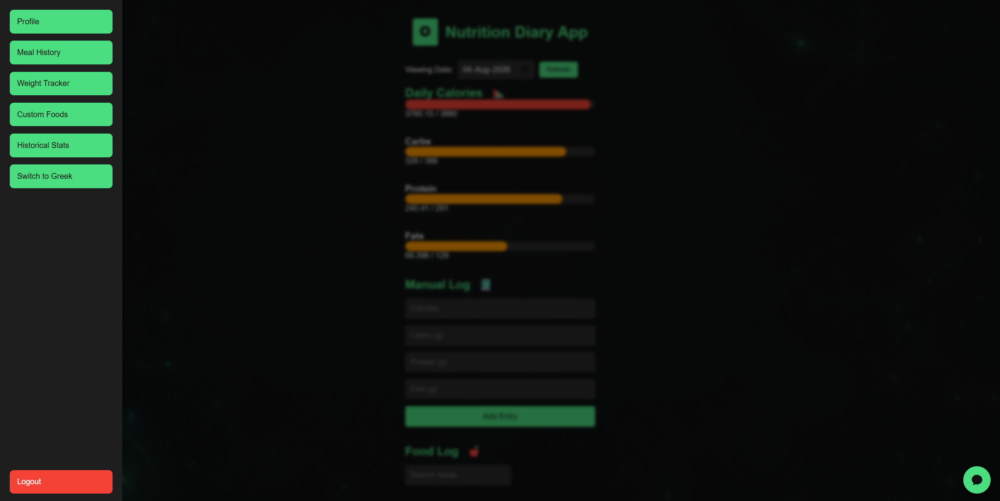

Meal History page showing logged meals, with edit/delete functionality , which updates the dashboard.

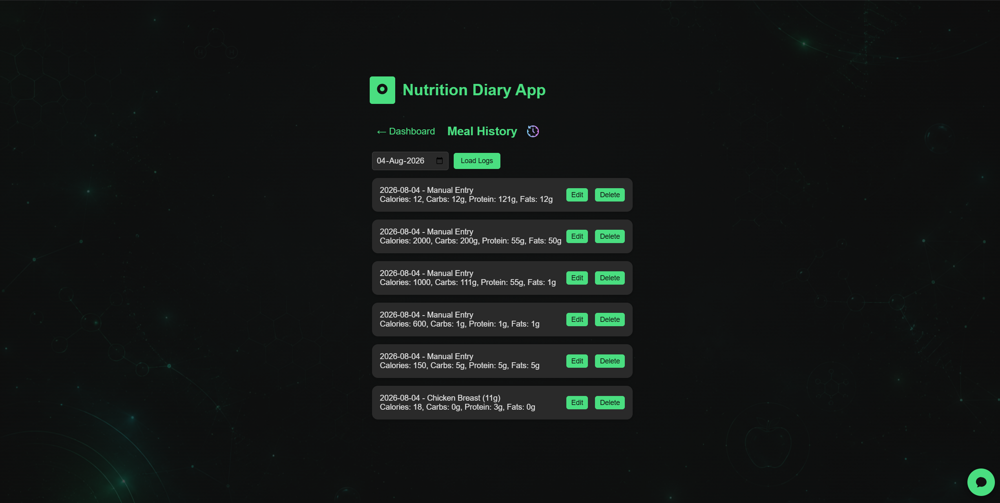

Custom Foods page to add or delete user-defined foods from the database.  

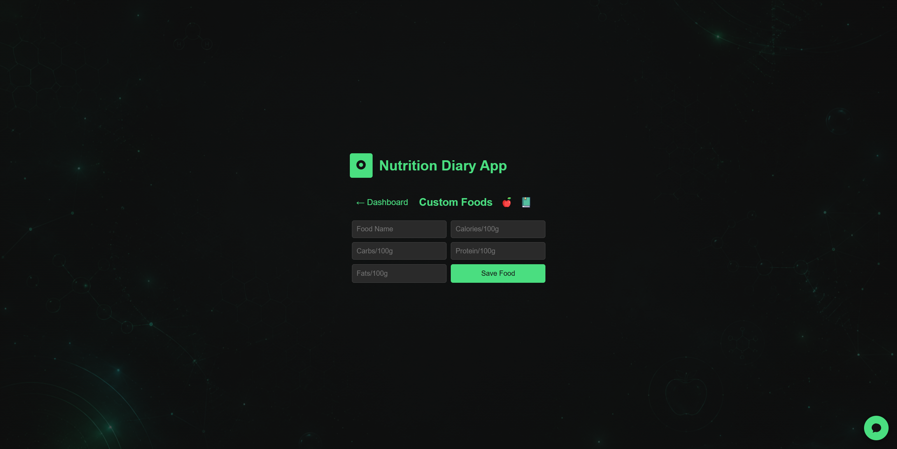

Weight Progress page to add/delete weight logs and view progress graph.  

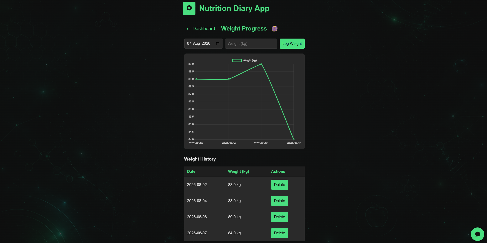

Historical Stats page calculates average daily calories, carbs, protein, and fats over a selected date range, highlights missing log days, and compares intake against goals with visual progress bars.

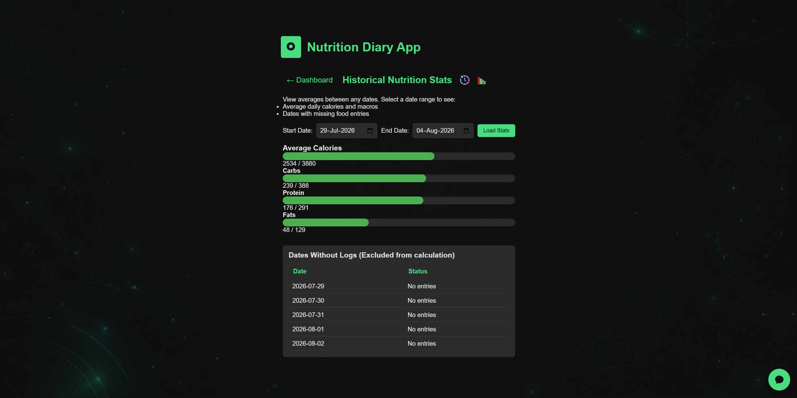


AI Assistant in Greek — the chat interface, placeholders, and quick-action labels are fully translated alongside the rest of the app's i18n system.

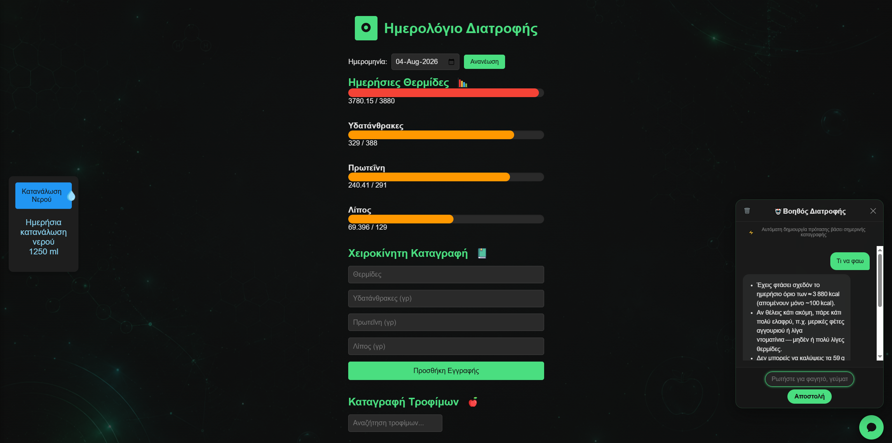

------------------------------------------------------------------
